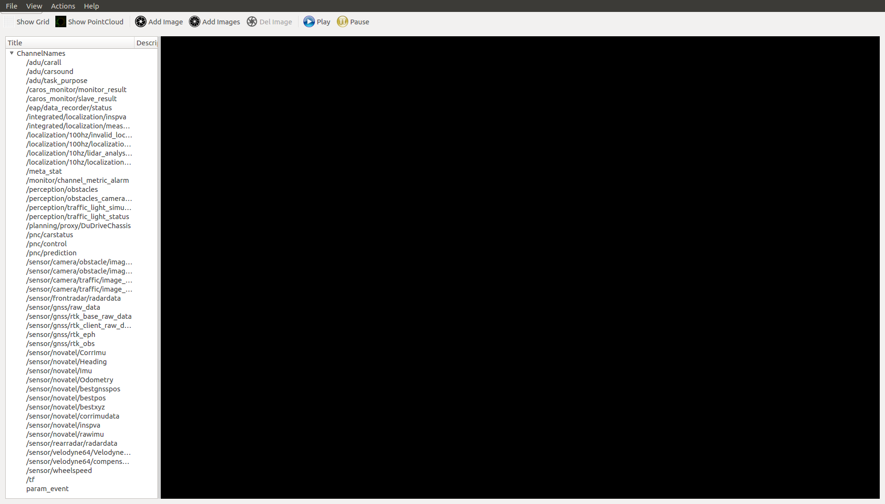

# 阿波罗 Cyber RT 开发者工具

阿波罗Cyber RT框架提供了一系列用于日常开发的有用工具，包括一个可视化工具**cyber\_visualizer**和两个命令行工具**cyber\_monitor**与**cyber\_recorder**

注：使用这些工具需要基于阿波罗Docker环境，请遵照阿波罗wiki进入正确的Docker容器

阿波罗Cyber RT中所有的工具都依赖阿波罗Cyber RT库，因此在使用阿波罗Cyber RT之前必须“source”目录中的“setup.bash”文件，请参考如下命令：

`username@computername:~$: source /your-path-to-apollo-install-dir/cyber/setup.bash`

## [cyber\_visualizer 工具](apollo-cyber-rt-developer-tool.md) <a id="cyber_visualizer&#x5DE5;&#x5177;"></a>

### 安装与运行

 **cyber\_visualizer**是为了展示阿波罗Cyber RT中各通道数据的可视化工具

```cpp
username@computername:~$: source /your-path-to-apollo-install-dir/cyber/setup.bash
username@computername:~$: cyber_visualizer
```

### 与可视化工具交互

* 在运行**cyber\_visualizer**之后，您将看到以下界面：


* 在Cyber RT中，当数据流通过通道传输，所有通道的列表将会在**ChannelNames**中展示，如下图所示。例如，您可以看到Cyber RT的数据记录工具（cyber\_recorder）在另一个终端中回放数据，**cyber\_visualizer**将接收所有活动通道的信息（从回放数据中）并展示它们。



* 通过点击工具栏中的按钮，可以使能参考格线、显示点云、添加图像、或同时显示多相机图像。如果您启用了“显示网格（Show Grid）”选项，则可以通过双击**ChannelNames**下面的“网格颜色选项（Grid-Color）”来设置网格的颜色。默认的颜色是灰色。您也可以通过编辑“网格数量（CellCount）”的数值来调整参考网格的格子数量。对于点云或者图像，可以通过调整其**ChannelName**子选项来选择数据源通道，并且通过调整**Action**子选项来播放或停止响应通道的数据。如下图所示，底部区域三个相机通道的数据和顶部区域一个点云数据同时显示在界面上。


* 如果要在三维点云场景中调整虚拟相机，可以在点云显示区域上点击鼠标右键。如下图所示，一个对话窗会弹出。


点云场景支持两种相机模式：自由模式（Free）和目标模式（Target）。（可以从上面弹出的对话窗口选择模式）

* 自由模式（Free）：在此种相机模式下，您可以通过按住鼠标左键或右键并拖动来改变相机的姿态。想要改变相机的俯仰角，您可以滚动鼠标滚轮。
* 目标模式（Target）：在此种相机模式下，您可以通过按住鼠标左键并拖动来改变相机的视场角，想要改变相机到观测点的距离（默认观测点的坐标是系统原点（0,0,0）），您可以滚动鼠标滚轮。

您也可以在对话框中更改相机在点云场景中的观测状态来直接修改相机信息，“步距（Step）”选项设定的是对话框中的步距数值。

将鼠标放在相机通道的图像上，您可以双击鼠标左键在左侧菜单栏中高亮显示对应的通道。在图像上单机鼠标右键，可以弹出删除相应相机频道的菜单。

播放和暂停按钮：单机播放按钮，显示所有通道。单机暂停按钮时，所有频道都会在工具上停止显示。

## [cyber\_monitor 工具](apollo-cyber-rt-developer-tool.md) <a id="cyber_monitor&#x5DE5;&#x5177;"></a>

### 安装与运行

命令行工具**cyber\_monitor**在终端中提供了阿波罗Cyber RT实时数据通道信息列表的清晰视图。

```cpp
username@computername:~$: source /your-path-to-apollo-install-dir/cyber/setup.bash
username@computername:~$: cyber_monitor
```

### 用户命令

#### 显示帮助信息

使用**-h**选项获得**cyber\_monitor**的帮助信息

`username@computername:~$: cyber_monitor -h`

#### 指定通道

使用**-c**选项，您可以让**cyber\_monitor**仅监控一个指定的通道，例如：

`username@computername:~$: cyber_monitor -c ChannelName`

## [用cyber\_monitor获得与UI界面类似的信息](apollo-cyber-rt-developer-tool.md) <a id="&#x7528;cyber_monitor&#x83B7;&#x5F97;&#x4E0E;UI&#x754C;&#x9762;&#x7C7B;&#x4F3C;&#x7684;&#x4FE1;&#x606F;"></a>

启动命令行工具后，您会发现它类似于**cyber\_visualizer**。它通过拓扑自动手机所有通道的信息，并将它们显示在两列（通道名称、通道数据类型）中。

通道信息默认显示为红色。但如果有数据流通过一个通道，对应该通道的一行将显示为绿色。如下图所示：


### 与cyber\_monitor交互

#### 常用命令

```cpp
ESC | q key ---- Exit 退出
Backspace ---- Back 后退
h | H ---- Show help page 显示帮助信息页面
```

#### 拓扑与通道的通用命令

```cpp
PageDown | Ctrl+d --- Next 下一步
PageUp | Ctrl+u --- Previous 上一步
Up, down or w, s keys ---- Move the current highlight line up and down 将当前高亮行上下移动
Right arrow or d key ---- Enter highlight line, display highlighted line data in detail 进入高亮的一行，显示高亮行数据细节
Left arrow or a key ------ Return to the previous layer from the current 从当前位置回到其前一层
Enter key ----- Same as d key 与d键相同，进入高亮行
```

#### 拓扑专有命令

f \| F ----- Display frame rate 显示帧率 t \| T ----- Display channel message type 显示消息格式 Space ----- Close\|Open channel \(only valid for channels with data arrival; yellow color after channel is closed\) 开关通道（只对接到数据的通道有效，通道关闭后呈黄色）

#### 通道专有命令

i \| I ----- Display channel Reader and Writer information 显示通道的读取方与写入方的信息 b \| B ------ Display channel message content 显示通道消息内容

#### 查看通道中重复数据字段

```cpp
n | N ---- Repeat the next data in the domain 在域（domain）中重现下一帧数据
m | M ---- Repeat one data on the domain 在域（domain）中重现一个数据
```

## [cyber\_recorder 工具](apollo-cyber-rt-developer-tool.md) <a id="cyber_recorder&#x5DE5;&#x5177;"></a>

**cyber\_recorder**是阿波罗Cyber RT提供的一种数据记录/回放工具，它提供了许多有用的功能，包括录制“数据记录\(record\)文件”、回放“数据记录\(record\)文件”、分割“数据记录\(record\)文件”、检查“数据记录\(record\)文件”的信息等等

### 安装与运行

运行cyber\_recorder

```cpp
$ source /your-path-to-apollo-install-dir/cyber/setup.bash
$ cyber_recorder
usage: cyber_recorder <command>> [<args>]
The cyber_recorder commands are:
    info                               Show information of an exist record. 显示目前存在记录的信息
    play                               Play an exist record. 回放一个存在的记录
    record                             Record same topic. 记录相同的话题（topic）
    split                              Split an exist record. 分割一个存在的记录
    recover                            Recover an exist record. 修复（拼接）一个存在的记录
```

### cyber\_recorder 命令

* 查看数据记录\(record\)文件的信息：

```cpp
$ cyber_recorder info -h
usage: cyber_recorder info [options]
    -h, --help                show help message 显示帮助信息
```

* 录制一个数据记录\(record\)文件

```cpp
$ cyber_recorder record -h
usage: cyber_recorder record [options]
    -o, --output <file>                output record file 输出一个记录文件
    -a, --all                          all channels 所有通道
    -c, --channel <name>               channel name 通道名称
    -i, --segment-interval <seconds>   record segmented every n second(s) 每n秒记录一个片段
    -m, --segment-size <MB>            record segmented every n megabyte(s) 每n兆数据记录一个片段
    -h, --help                         show help message 显示帮助信息
```

* 回放数据记录\(record\)文件：

```cpp
$ cyber_recorder play -h
usage: cyber_recorder play [options]
    -f, --file <file>            input record file 输入一个记录文件
    -a, --all                play all 回放所有
    -c, --white-channel <name>        only play the specified channel 只回放特定通道数据
    -k, --black-channel <name>        not play the specified channel 不回放特定通道数据
    -l, --loop                loop play 循环回放
    -r, --rate <1.0>            multiply the play rate by FACTOR 以某倍率回放
    -b, --begin <2018-07-01 00:00:00>    play the record begin at 从某处开始回放
    -e, --end <2018-07-01 00:01:00>    play the record end at 从某处结束回放
    -s, --start <seconds>        play started at n seconds 在n秒后开始回放
    -d, --delay <seconds>        play delayed n seconds 回放在n秒后延迟
    -p, --preload <seconds>        play after trying to preload n second(s) 尝试在预加载n秒后播放
    -h, --help                show help message 显示帮助信息
```

* 分割数据记录\(record\)文件：

```cpp
$ cyber_recorder split -h
usage: cyber_recorder split [options]
    -f, --file <file>                  input record file 输入记录文件
    -o, --output <file>                output record file 输出记录文件
    -a, --all                          all channels 所有通道
    -c, --channel <name>               channel name 通道名称
    -b, --begin <2018-07-01 00:00:00>  begin at assigned time 从指定时间开始
    -e, --end <2018-07-01 01:00:00>    end at assigned time 从指定时间结束
```

* 修复（拼接）数据记录\(record\)文件：

```cpp
$ cyber_recorder recover -h
usage: cyber_recorder recover [options]
    -f, --file <file>                  input record file 输入记录文件
    -o, --output <file>                output record file 输出记录文件
```

### 使用cyber\_recorder的样例

#### 查看数据记录\(record\)文件细节

```cpp
$ cyber_recorder info demo.record
record_file:    demo.record
version:        1.0
duration:       19.995227 Seconds
begin_time:     2018-04-17 06:25:36
end_time:       2018-04-17 06:25:55
size:           28275479 Bytes (26.965598 MB)
is_complete:    true
message_number: 15379
channel_number: 16
channel_info:   /apollo/localization/pose                             2000 messages : apollo.localization.LocalizationEstimate
                /tf                                                   4000 messages : apollo.transform.TransformStampeds
                /apollo/control                                       2000 messages : apollo.control.ControlCommand
                /apollo/sensor/gnss/odometry                          2000 messages : apollo.localization.Gps
                /apollo/canbus/chassis                                2000 messages : apollo.canbus.Chassis
                /apollo/sensor/gnss/imu                               1999 messages : apollo.drivers.gnss.Imu
                /apollo/sensor/gnss/rtk_obs                             41 messages : apollo.drivers.gnss.EpochObservation
                /apollo/sensor/gnss/ins_stat                            20 messages : apollo.drivers.gnss.InsStat
                /apollo/sensor/gnss/best_pose                           20 messages : apollo.drivers.gnss.GnssBestPose
                /apollo/perception/obstacles                           400 messages : apollo.perception.PerceptionObstacles
                /apollo/prediction                                     400 messages : apollo.prediction.PredictionObstacles
                /apollo/sensor/conti_radar                             270 messages : apollo.drivers.ContiRadar
                /apollo/planning                                       200 messages : apollo.planning.ADCTrajectory
                /apollo/monitor/static_info                              1 messages : apollo.data.StaticInfo
                /apollo/sensor/gnss/rtk_eph                             25 messages : apollo.drivers.gnss.GnssEphemeris
                /apollo/monitor                                          3 messages : apollo.common.monitor.MonitorMessage
```

#### 录制数据记录\(record\)文件

```cpp
$ cyber_recorder record -a
[RUNNING]  Record :     total channel num : 1  total msg num : 5
...
```

#### 回放数据记录\(record\)文件

```cpp
$ cyber_recorder play -f 20180720202307.record
file: 20180720202307.record, chunk_number: 1, begin_time: 1532089398663399667, end_time: 1532089404688079759, message_number: 75
please wait for loading and playing back record...
Hit Ctrl+C to stop replay, or Space to pause.
[RUNNING]  Record Time: 1532089404.688080    Progress: 6.024680 / 6.024680
play finished. file: 20180720202307.record
```

## [rosbag\_to\_record 工具](apollo-cyber-rt-developer-tool.md) <a id="rosbag_to_record&#x5DE5;&#x5177;"></a>

**rosbag\_to\_record**是阿波罗Cyber RT提供的一个能够将rosbag文件转化为数据记录\(record\)文件的工具。

目前这个工具支持以下通道：

```cpp
/apollo/perception/obstacles
/apollo/planning
/apollo/prediction
/apollo/canbus/chassis
/apollo/control
/apollo/guardian
/apollo/localization/pose
/apollo/perception/traffic_light
/apollo/drive_event
/apollo/sensor/gnss/odometry
/apollo/monitor/static_info
/apollo/monitor
/apollo/canbus/chassis_detail
/apollo/control/pad
/apollo/navigation
/apollo/routing_request
/apollo/routing_response
/tf
/tf_static
/apollo/sensor/conti_radar
/apollo/sensor/delphi_esr
/apollo/sensor/gnss/best_pose
/apollo/sensor/gnss/imu
/apollo/sensor/gnss/ins_stat
/apollo/sensor/gnss/rtk_eph
/apollo/sensor/gnss/rtk_obs
/apollo/sensor/velodyne64/compensator/PointCloud2
```

### 安装与运行

运行 rosbag\_to\_record

```cpp
$ source /your-path-to-apollo-install-dir/cyber/setup.bash
$ rosbag_to_record
Usage:
  rosbag_to_record input.bag output.record
```

### 样例

我们将阿波罗2.5的demo数据包转成了数据记录\(record\)文件格式

```cpp
$ rosbag_to_record demo_2.5.bag demo.record
record_file:    demo.record
version:        1.0
duration:       19.995227 Seconds
begin_time:     2018-04-17 06:25:36
end_time:       2018-04-17 06:25:55
size:           28275479 Bytes (26.965598 MB)
is_complete:    true
message_number: 15379
channel_number: 16
channel_info:   /apollo/localization/pose                             2000 messages : apollo.localization.LocalizationEstimate
                /tf                                                   4000 messages : apollo.transform.TransformStampeds
                /apollo/control                                       2000 messages : apollo.control.ControlCommand
                /apollo/sensor/gnss/odometry                          2000 messages : apollo.localization.Gps
                /apollo/canbus/chassis                                2000 messages : apollo.canbus.Chassis
                /apollo/sensor/gnss/imu                               1999 messages : apollo.drivers.gnss.Imu
                /apollo/sensor/gnss/rtk_obs                             41 messages : apollo.drivers.gnss.EpochObservation
                /apollo/sensor/gnss/ins_stat                            20 messages : apollo.drivers.gnss.InsStat
                /apollo/sensor/gnss/best_pose                           20 messages : apollo.drivers.gnss.GnssBestPose
                /apollo/perception/obstacles                           400 messages : apollo.perception.PerceptionObstacles
                /apollo/prediction                                     400 messages : apollo.prediction.PredictionObstacles
                /apollo/sensor/conti_radar                             270 messages : apollo.drivers.ContiRadar
                /apollo/planning                                       200 messages : apollo.planning.ADCTrajectory
                /apollo/monitor/static_info                              1 messages : apollo.data.StaticInfo
                /apollo/sensor/gnss/rtk_eph                             25 messages : apollo.drivers.gnss.GnssEphemeris
                /apollo/monitor                                          3 messages : apollo.common.monitor.MonitorMessage
Conversion finished! Took 0.505623051 seconds in total.
```

